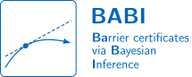
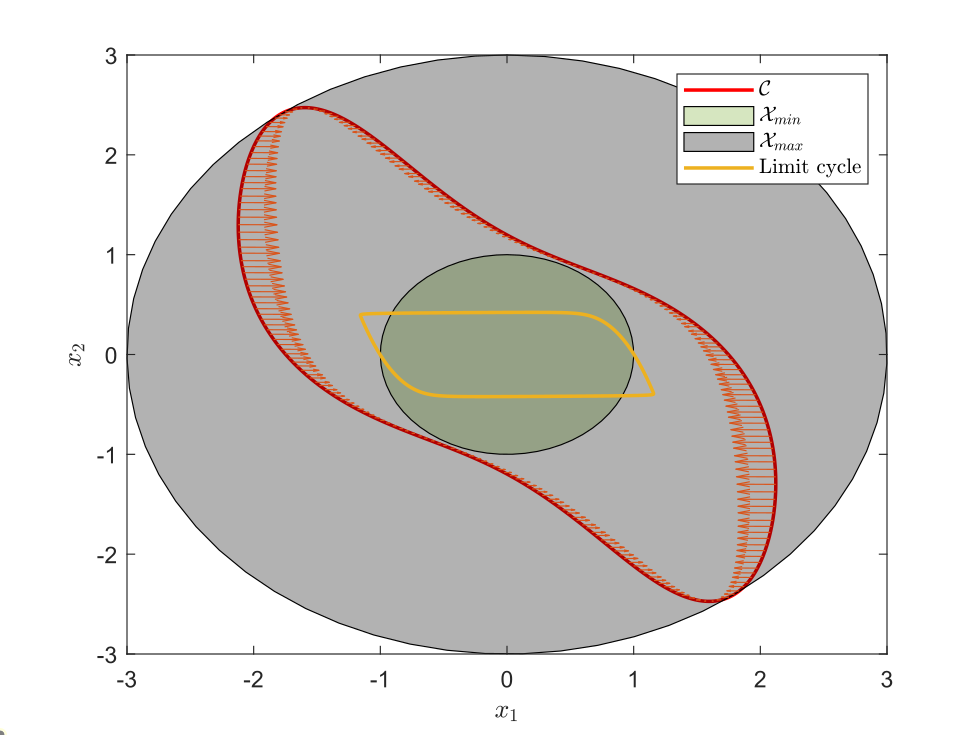

<p align="center">

</p>

# `BABI`: Barrier Certificates via Bayesian Inference
`BABI` is a software package to identify and verify forward-invariant sets of unknown dynamical systems with latent states and polynomial dynamics, using only input–output data. To enable data-efficient inference with rigorous uncertainty quantification, a Bayesian approach is employed: a prior in state-space representation, which allows incorporating structural insights or domain knowledge, is updated with a targeted marginal Metropolis–Hastings (MMH) sampler. Posterior samples are then used to synthesize a barrier certificate and corresponding invariant set via a sum-of-squares (SOS) optimization problem. An additional test set of posterior samples provides finite-sample probabilistic guarantees that the certificate holds for the true, unknown system.

The approach is explained in the paper "Barrier Certificates for Unknown Systems with Latent States and Polynomial Dynamics using Bayesian Inference", available as a preprint on [arXiv](https://doi.org/10.48550/arXiv.2504.01807).

## Installation and Requirements
To run the code, the following software is required:
* [MATLAB](https://mathworks.com/products/matlab.html) (tested with R2024b), including:
    - _Parallel Computing Toolbox_ (for Monte Carlo simulations)
    -  _Symbolic Math Toolbox_ (for plotting forward-invariant sets)
* [SOSTOOLS](https://github.com/oxfordcontrol/SOSTOOLS) (tested with v4.03): download and add to the MATLAB path, e.g., `addpath(genpath('Path\to\SOSTOOLS'))`.
* [MOSEK](https://www.mosek.com/) (tested with v11.0.13): default SDP solver. A free academic license is available. Install according to the [documentation](https://docs.mosek.com/latest/install/installation.html) and add MOSEK to the MATLAB path.

MOSEK is the recommended SDP solver. Other solvers (e.g., [SeDuMi](https://github.com/sqlp/sedumi)) may work with SOSTOOLS, but this has not been tested and results may differ.

All experiments reported in the paper were run under Windows 11 with the software versions listed above. The code is expected to work on other platforms with MATLAB support.

> **⚠️ Warning**
>
> With older MATLAB releases (e.g., R2021b), we observed compatibility issues between SOSTOOLS and MOSEK that may cause the validation of barrier certificates to fail.

## Usage and Experiments
The `/experiments` folder contains scripts that reproduce the results presented in Section V of the paper. These serve as examples of how to use the code. Users are encouraged to start by exploring these examples to understand how the code works. Since the implementation heavily relies on [SOSTOOLS](https://github.com/oxfordcontrol/SOSTOOLS), we recommend consulting its documentation for details on the SOS formulation.
1. `autocorrelation.m`: reproduces the autocorrelation analysis of the MMH sampler (Figure 2 in the paper).
2. `exemplary_run.m`: generates the forward-invariant set and barrier function for a single run (Figure 3 in the paper).
3. `monte_carlo_posterior.m`: runs the Monte Carlo simulation of the proposed method (Table 1; column _Posterior (proposed method)_).
4. `monte_carlo_prior.m`: runs the Monte Carlo simulation of the baseline method (Table 1; column _Prior (baseline)_).

Below is an example output from `experiments/exemplary_run.m`, showing the synthesized forward-invariant set $\mathcal{C}$ (red) enclosing the system’s limit cycle (yellow), with circular regions $\mathcal{X}\_{\text{min}}$ (green) and $\mathcal{X}\_{\text{max}}$ (grey).



## Reference
If you use this software in your research, please cite the following paper:
```
@article{BABI2025,
 title={Barrier Certificates for Unknown Systems with Latent States and Polynomial Dynamics using Bayesian Inference},
 author={Lefringhausen, Robert and Noel Aziz Hanna, Sami Leon and August, Elias and Hirche, Sandra},
 journal={arXiv preprint arXiv:2504.01807},
 year={2025}
}
```